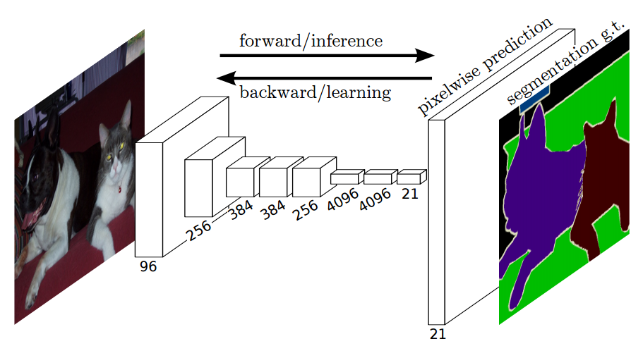

# Semantic Segmentation
### Introduction
In this project, I have labelled the pixels of a road in images using a Fully Convolutional Network (FCN).

### Setup
##### GPU
Make sure the environment is using a GPU
##### Frameworks and Packages
Make sure you have the following is installed:
 - [Python 3](https://www.python.org/)
 - [TensorFlow](https://www.tensorflow.org/)
 - [NumPy](http://www.numpy.org/)
 - [SciPy](https://www.scipy.org/)
##### Dataset
Download the [Kitti Road dataset](http://www.cvlibs.net/datasets/kitti/eval_road.php) from [here](http://www.cvlibs.net/download.php?file=data_road.zip).  Extract the dataset in the `data` folder.  This will create the folder `data_road` with all the training a test images.


### Work description
##### Scene Understanding
In order for a self-driving vehicle to understand what is a safe area to drive,
 it needs to determine the types of objects that are in-front of the vehicle.
  For that we could use the following two general approaches:

1) Object detection using bounding boxes - draw a box around an object
see [SSD](https://arxiv.org/pdf/1512.02325v5.pdf), [YOLO](https://arxiv.org/abs/1506.02640)
2) Semantic Segmentation - Assign meaning to part of an object, by predicting
 labels for each pixel, rather than drawing a bounding box.

Object detection provides high FPS and is able to detect people, cars, 
traffic lights etc, but is not ideal for curvy objects like roads, sky, lakes
 etc, hence we will use Semantic Segmentation
 
##### Fully Convolutional Networs for Semantic Segmentation


The architecture is based on the  ["Fully Convolutional Networks for Semantic Segmentation"](https://people.eecs.berkeley.edu/~jonlong/long_shelhamer_fcn.pdf), by Long, 
 Shelhamer, and Darrell, at UC Berkeley. The goal of
 semantic segmentation is to produce an output image which is similar to the 
 input image, and it has an assigned class: driveable-road, opposite-side-road, 
 others for each pixel. 


Fully Convolutional Networks (FCNs) do not have a fully connected layer at the 
end, 
instead there are convolutional layers to classify each pixel. As seen in the
 above picture FCNs combine the upsampled intermediate layers, in order to 
 "deconvolute" the image into classes for each pixel.


##### Training
For training, I used the following params:
   keep_prob: 0.5
   learning_rate: 0.0001
   batch_size = 10
   epochs = 20

I used two trials, 

A) Using two classes: 1) Road 2) Everything else


B) Using three classes: 1) Road, 2) opposite road 3) Everything else


##### Run
Run the following command to run the project:
```
python main.py
``` 


